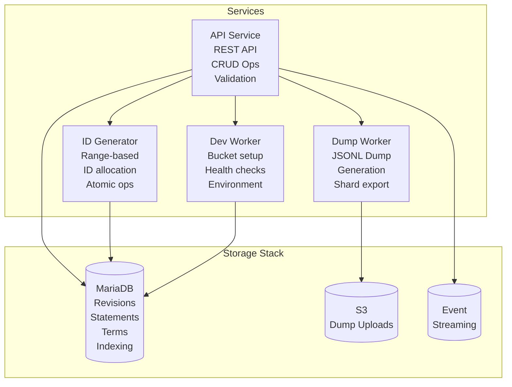

# Entitybase Backend
[](https://codecov.io/gh/dpriskorn/entitybase-backend)

A clean-room, billion-scale Wikibase JSON and RDF schema compatible backend architecture 
based on immutable revision snapshots and MariaDB indexing.

It is designed to support 1bn+ entities and 1tn unique statements.

## Core Principles

**The Immutable Revision Invariant:**

A revision is an immutable snapshot stored in MariaDB. Once written, it never changes.

- No mutable revisions
- No diff storage
- No page-based state
- No MediaWiki-owned content

Everything else in the system derives from this rule.

## Architecture Overview

### System Architecture

The Entitybase Backend implements a microservices architecture designed for billion-scale Wikibase operations:



### Service Components

#### **API Service (Main Application)**
- **FastAPI-based REST API** serving Wikibase-compatible endpoints
- **Type-specific CRUD operations**:
  - `POST /item` - Create items (auto-assign Q IDs)
  - `PUT /item/Q{id}` - Update items
  - `GET /item/Q{id}` - Read items
  - `DELETE /item/Q{id}` - Delete items
  - Similar endpoints for properties (`/property/P{id}`), lexemes (`/lexeme/L{id}`)
- **Validation & business logic** for all entity operations
- **Statement deduplication** and RDF generation integration

#### **ID Generator Worker**
- **Range-based ID allocation** to prevent database write hotspots
- **Scalable to 777K+ entities/day** (10 edits/sec, 90% new entities)
- **Atomic operations** via MariaDB locking
- **Auto-scaling** via Docker Compose replicas
- **Health monitoring** and range utilization tracking

#### **Dump Worker Service**
- **JSONL Entity Dumps**: Generate complete entity exports in JSON Lines format
- **S3 Integration**: Store dumps in dedicated S3 bucket
- **Raw Revision Data**: Export full revision content without manipulation
- **Shard-based Processing** (Planned): Process entities by shard for scalability
- **Parallel Processing** (Planned): Large-scale dump generation

### Storage Stack

#### **MariaDB (System of Record)**
- **All data**: Revisions, statements, terms, sitelinks, references, qualifiers, snaks
- **Immutable snapshots**: Entity content stored as immutable revision rows
- **Versioned storage**: Complete revision history with perfect auditability
- **Statement deduplication**: Shared statement objects with reference counting
- **Indexing**: Entity metadata, head pointers, timestamps, ID ranges, redirects

#### **S3 (Dump Uploads Only)**
- **JSONL exports**: Generated entity dumps for download
- **No primary storage**: All entity data lives in MariaDB

#### **Event Streaming**
- **Change notifications**: Real-time entity change events
- **RDF streaming**: Continuous RDF triple updates
- **Consumer decoupling**: Asynchronous processing of entity changes

### Key Concepts

- **Entity**: A logical identifier (Q123, P456, etc.) with no intrinsic state
- **Revision**: Complete, immutable snapshot stored in MariaDB
- **Head Pointer**: Current revision managed via compare-and-swap in MariaDB
- **Statement Deduplication**: Shared statement objects with reference counting
- **ID Ranges**: Pre-allocated blocks of entity IDs to prevent write hotspots

### Scaling Characteristics

- **Entity Creation**: 777K/day sustained (10 edits/sec, 90% new entities)
- **Storage Growth**: 2.84B entities over 10 years
- **Read Performance**: Sub-millisecond via MariaDB indexing and caching
- **Write Performance**: Range-based ID allocation eliminates bottlenecks

### Service Components

#### **Dev Worker Service** ✅
- **Database Setup**: Automated MariaDB schema creation and health checks
- **Environment Setup**: Development infrastructure provisioning
- **CLI Interface**: Command-line tools for setup operations
- **Health Monitoring**: Database accessibility and status reporting

**Key Features**:
- Automated MariaDB schema initialization (revisions, statements, terms, etc.)
- Idempotent setup operations
- Development workflow integration
- Incremental change streaming for real-time RDF updates
- Compression and partitioning for efficient storage/distribution
- Health monitoring and progress tracking
- Integration with existing RDF builder infrastructure

#### **Additional Services (Future)**
- **Analytics Service**: Usage statistics and performance monitoring
- **Replication Service**: Cross-region data replication
- **Backup Service**: Automated MariaDB backup coordination

## Getting Started

Start with [ARCHITECTURE.md](./doc/ARCHITECTURE/ARCHITECTURE.md) for the complete architecture overview.

### Quick Start

```bash
# Start the full stack
docker-compose up -d

# API available at http://localhost:8000
# MariaDB at http://localhost:3306
```

#### MinIO Bucket Setup

The system uses one S3-compatible bucket for dump uploads:

- **`wikibase-dumps`**: Stores entity export dumps

Use either the setup script or dev worker CLI to create this bucket automatically.

### Design Philosophy

- **Immutability**: All content is stored as immutable snapshots in MariaDB
- **Eventual consistency**: With reconciliation guarantees and no data loss
- **Horizontal scalability**: MariaDB for storage and indexing, workers for specialized tasks
- **Microservices architecture**: Dedicated services for API, ID generation, and dump processing
- **Auditability**: Perfect revision history by design
- **Decoupling**: MediaWiki + Wikibase becomes a stateless API client
- **Performance-first**: Range-based ID allocation eliminates write hotspots
- **Type safety**: Dedicated endpoints for each Wikibase entity type

## Features

### Redirect Support
- **Create redirects**: Entity API endpoint to mark entities as redirects to other entities
- **Revert redirects**: Entity API endpoint to revert redirects back to normal entities using revision-based restore
- **RDF generation**: RDF builder generates `owl:sameAs` statements for all incoming redirects
- **MariaDB integration**: Redirects stored in MariaDB `entity_redirects` table for efficient querying
- **Schema v1.1.0**: Added `redirects_to` field to mark redirect entities
- **Immutable tombstones**: Redirect entities have empty entity data with only `redirects_to` field
- **Authoritative source**: MariaDB is the single source of truth for redirect relationships
- **Test cache fallback**: File-based cache for testing without MariaDB connection

### Statement Deduplication
- **Hash-based storage**: All statements stored as deduplicated objects with hash-based references
- **Property-based loading**: Efficient fetching of statements by property with counts for intelligent loading
- **Most-used analytics**: Query most used statements across the system for scientific analysis
- **Orphaned cleanup**: Background job for cleaning up orphaned statements (ref_count=0)

### Entity Protection
- **Lock/Unlock**: `/entities/{entity_id}/lock` (POST/DELETE) - Full edit lock
- **Archive/Unarchive**: `/entities/{entity_id}/archive` (POST/DELETE) - Archive entities
- **Semi-protect/Unprotect**: `/entities/{entity_id}/semi-protect` (POST/DELETE) - Semi-protection
- **Mass-edit-protect/Unprotect**: `/entities/{entity_id}/mass-edit-protect` (POST/DELETE) - Mass edit protection
- **Idempotent**: All protection endpoints return success if entity is already in target state

### Type-Specific Endpoints
- **Item endpoints**: `/item` for item entities (Q IDs)
- **Property endpoints**: `/property` for property entities (P IDs)
- **Lexeme endpoints**: `/lexeme` for lexeme entities (L IDs)

# License
GPLv3+ 

# Copyright 
Nizo Priskorn 2026 

## External links
* https://www.mediawiki.org/wiki/User:So9q/Scaling_issues Implemenatation history and on-wiki details
