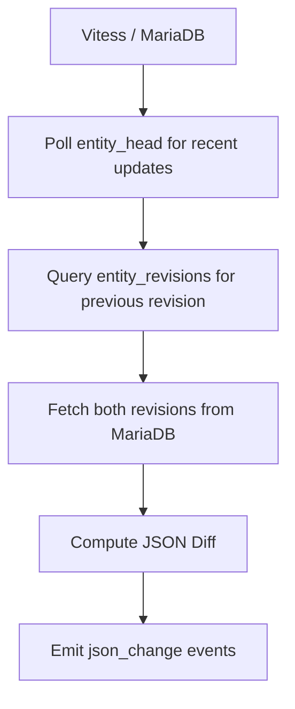

# MediaWiki-Independent Change Detection

## Overview

MediaWiki-independent change detection enables computing recent entity changes without depending on MediaWiki EventBus. This system uses the existing MariaDB + Vitess storage infrastructure to detect changes by comparing revision data.

## Core Principle

**Poll entity_head and fetch previous revision from entity_revisions, compare revision data**

Since MariaDB stores complete entity revision data and Vitess provides ordered revision metadata, we can compute changes by:
1. Polling entity_head for recently updated entities
2. Querying entity_revisions for the previous revision
3. Fetching both revisions from MariaDB
4. Computing JSON diffs between revisions
5. Emitting rdf_change events directly

## Architecture

### Service: Revision Change Detector

**Purpose**: Poll Vitess and compute recent entity changes using MariaDB revision data

### Data Flow



## Algorithm Options

### Algorithm 1: MariaDB-Based Approach

Recommended when MediaWiki events are unavailable or unreliable:

```
1. Poll entity_head for recently updated entities:
   SELECT entity_id, head_revision_id, updated_at
   FROM entity_head
   WHERE updated_at >= DATE_SUB(NOW(), INTERVAL 1 HOUR)
   ORDER BY updated_at ASC
   LIMIT 100000;

2. For each changed entity:
   a. Get current revision from entity_head
      current_rev_id = head_revision_id
      current_revision = mariadb.read(entity_id, current_rev_id)

   b. Query entity_revisions for previous revision:
      SELECT revision_id, entity_json
      FROM entity_revisions
      WHERE entity_id = ? AND revision_id < ?
      ORDER BY revision_id DESC
      LIMIT 1

   c. Fetch previous revision from MariaDB:
      if previous_revision exists:
         prev_revision = mariadb.read(entity_id, previous_rev_id)

   d. Compute JSON diff between revisions:
      Use library: google-diff-match-patch, jsondiffpatch, or custom

   e. Emit json_change event if diff detected
```

### Algorithm 2: MediaWiki Event-Based Approach

Simpler option when MediaWiki is available and emitting events:

```
1. Consume MediaWiki change events (from existing EventBus)
2. Extract entity_id and revision_id from event
3. Fetch revision data from MariaDB: mariadb.read(entity_id, rev_id)
4. Convert revision JSON to RDF (Turtle format)
5. Emit rdf_change event with operation: import (for new entity) or diff (if tracking previous state)
```

### Recommendation

Start with MediaWiki event-based approach if MediaWiki is available and emitting events. Use MariaDB-based approach only if you need MediaWiki independence.

## Key Design Decisions

### No New Tables Required

Uses existing `entity_head` and `entity_revisions` tables only:
- `entity_head`: Always contains current head revision and last update time
- `entity_revisions`: Ordered revision history with entity JSON data

### No Change History Stored

Just query for recent updates and previous revision. Change history is implicitly stored in MariaDB revision data.

### Simple Checkpointing

`entity_head.head_revision_id` is always the latest state. Poll based on `updated_at` timestamp.

## Event Schema

### Internal JSON Change Event

Optional internal event for JSON→RDF conversion pipeline. May be optional if direct pipeline from change detection to RDF.

```yaml
# Internal event for JSON→RDF conversion pipeline
# May be optional if direct pipeline from change detection to RDF
entity_id: string
from_revision_id: integer
to_revision_id: integer
json_diff: array  # JSON patch operations
```

### Final RDF Change Event

Uses standard `rdf_change/2.0.0` schema:

```yaml
# Continuous change event
$schema: /mediawiki/wikibase/entity/rdf_change/2.0.0
entity_id: "Q42"
operation: "diff"
rev_id: 327
sequence: 0
sequence_length: 1
rdf_added_data:
  data: |
    <http://www.wikidata.org/entity/Q42> rdfs:label "New Label"@en .
    <http://www.wikidata.org/entity/Q42> p:P31 <http://www.wikidata.org/entity/Q5> .
  mime_type: text/turtle
rdf_deleted_data:
  data: |
    <http://www.wikidata.org/entity/Q42> rdfs:label "Old Label"@en .
    <http://www.wikidata.org/entity/Q42> p:P31 <http://www.wikidata.org/entity/Q123> .
  mime_type: text/turtle
```

## Implementation Details

### Polling Strategy

#### Interval-Based Polling

```python
def poll_entity_head(vitess_client, interval_seconds=300, batch_size=100000):
    """Poll entity_head at regular intervals"""
    while True:
        cutoff_time = datetime.now() - timedelta(seconds=interval_seconds)
        
        # Query recently updated entities
        entities = vitess_client.query(
            "SELECT entity_id, head_revision_id, updated_at "
            "FROM entity_head "
            "WHERE updated_at >= %s "
            "ORDER BY updated_at ASC "
            "LIMIT %s",
            (cutoff_time, batch_size)
        )
        
        # Process batch
        for entity in entities:
            process_entity_change(entity)
        
        # Wait before next poll
        time.sleep(interval_seconds)
```

#### Checkpoint-Based Polling

```python
def poll_with_checkpoint(vitess_client, checkpoint_file="checkpoint.json"):
    """Resume from last checkpoint"""
    # Load last processed timestamp
    checkpoint = load_checkpoint(checkpoint_file)
    last_processed = checkpoint.get('last_processed_time')
    
    while True:
        # Query entities after checkpoint
        entities = vitess_client.query(
            "SELECT entity_id, head_revision_id, updated_at "
            "FROM entity_head "
            "WHERE updated_at > %s "
            "ORDER BY updated_at ASC "
            "LIMIT 100000",
            (last_processed,)
        )
        
        if not entities:
            time.sleep(60)
            continue
        
        # Process entities
        max_processed = last_processed
        for entity in entities:
            process_entity_change(entity)
            if entity.updated_at > max_processed:
                max_processed = entity.updated_at
        
        # Update checkpoint
        checkpoint['last_processed_time'] = max_processed
        save_checkpoint(checkpoint_file, checkpoint)
```

### MariaDB Revision Fetching

```python
def fetch_revisions_batch(entity_ids, batch_size=1000):
    """Fetch revisions from MariaDB in parallel batches"""
    for batch_start in range(0, len(entity_ids), batch_size):
        batch = entity_ids[batch_start:batch_start + batch_size]
        
        # Query MariaDB for revision data
        revisions = []
        for entity_id, revision_id in batch:
            result = db.query(
                "SELECT entity_id, revision_id, entity_json "
                "FROM entity_revisions "
                "WHERE entity_id = %s AND revision_id = %s",
                (entity_id, revision_id)
            )
            if result:
                revisions.append(result[0])
        
        yield zip(batch, revisions)
```

### JSON Diff Computation

```python
import jsondiffpatch

diffpatcher = jsondiffpatch.diffpatcher()

def compute_json_diff(prev_json, curr_json):
    """Compute diff between two entity JSON revisions"""
    return diffpatcher.diff(prev_json, curr_json)

def format_json_diff(diff):
    """Format diff as JSON Patch (RFC 6902) operations"""
    # Convert jsondiffpatch format to JSON Patch operations
    patches = []
    for path, change in diff.items():
        if change[0] == jsondiffpatch.DELETE:
            patches.append({"op": "remove", "path": f"/{path}"})
        elif change[0] == jsondiffpatch.INSERT:
            patches.append({"op": "add", "path": f"/{path}", "value": change[1]})
        elif change[0] == jsondiffpatch.UPDATE:
            patches.append({
                "op": "replace",
                "path": f"/{path}",
                "value": change[1]
            })
    return patches
```

## Technology Stack

### Language Options

- **Python**: Easy prototyping, good JSON libraries, async support
- **Scala**: Good for streaming, strong type system
- **Go**: Excellent performance, great concurrency primitives

### Recommended Libraries

| Purpose | Library Options |
|---------|-----------------|
| Vitess client | `go-vitess`, `vtgate-client`, SQL proxy |
| Database client | MySQL/MariaDB connector, SQLAlchemy |
| Diff library | `google-diff-match-patch`, `jsondiffpatch` |
| Kafka producer | `confluent-kafka`, `sarama` |
| RDF conversion | rdflib (Python), Jena (Java), RDF4J (Java) |

## Configuration

| Option | Description | Default |
|---------|-------------|---------|
| `vitess_host` | Vitess VTGate host | localhost:15991 |
| `mariadb_host` | MariaDB host for revision data | localhost:3306 |
| `mariadb_database` | MariaDB database name | entitybase |
| `poll_interval` | How often to poll entity_head for changes | 300s (5 minutes) |
| `batch_size` | Entities to process in parallel | 1000 |
| `kafka_topic` | Topic to emit RDF changes | wikibase.rdf_change |
| `change_detection_enabled` | Enable/disable change detection | true |
| `use_mediawiki_events` | Consume MediaWiki events directly | false |
| `checkpoint_file` | File to store processing checkpoint | checkpoint.json |

## Error Handling

### Revision Fetch Errors

```python
def fetch_revision_with_retry(db_client, entity_id, revision_id, max_retries=3):
    """Fetch revision from MariaDB with exponential backoff retry"""
    for attempt in range(max_retries):
        try:
            return db_client.query(
                "SELECT entity_json FROM entity_revisions "
                "WHERE entity_id = %s AND revision_id = %s",
                (entity_id, revision_id)
            )
        except Exception as e:
            if attempt == max_retries - 1:
                raise
            wait_time = 2 ** attempt
            time.sleep(wait_time)
            logging.warning(f"Retry {attempt + 1} for {entity_id}/r{revision_id}")
```

### Vitess Query Errors

```python
def query_with_timeout(vitess_client, query, params, timeout=30):
    """Query Vitess with timeout"""
    try:
        result = vitess_client.query(query, params, timeout=timeout)
        return result
    except TimeoutError:
        logging.error(f"Query timeout: {query}")
        raise
    except Exception as e:
        logging.error(f"Vitess query error: {e}")
        raise
```

## Monitoring and Metrics

### Key Metrics

- **Poll latency**: Time between entity update and detection
- **Processing throughput**: Entities processed per second
- **Revision fetch latency**: Time to fetch revisions from MariaDB
- **Diff computation time**: Time to compute JSON diffs
- **Kafka emission rate**: Events emitted per second
- **Error rate**: Failed entity processing attempts

### Example Metrics (Prometheus format)

```
# Polling metrics
change_detection_poll_duration_seconds[summary]
change_detection_entities_processed_total[counter]
change_detection_entities_failed_total[counter]

# MariaDB metrics
revision_fetch_duration_seconds[summary]
revision_fetch_total[counter]

# Diff metrics
json_diff_computation_duration_seconds[summary]
json_diff_size_bytes[histogram]

# Kafka metrics
kafka_emission_duration_seconds[summary]
kafka_emission_success_total[counter]
kafka_emission_failed_total[counter]
```

## Backfill Capability

One of the key advantages of MediaWiki-independent change detection is the ability to backfill historical changes:

```python
def backfill_changes(vitess_client, start_time, end_time):
    """Backfill changes for a time range"""
    cutoff_start = datetime.strptime(start_time, "%Y-%m-%d")
    cutoff_end = datetime.strptime(end_time, "%Y-%m-%d")
    
    entities = vitess_client.query(
        "SELECT entity_id, head_revision_id, updated_at "
        "FROM entity_head "
        "WHERE updated_at >= %s AND updated_at <= %s "
        "ORDER BY updated_at ASC",
        (cutoff_start, cutoff_end)
    )
    
    for entity in entities:
        process_entity_change(entity)
```

## Advantages

| Benefit | Description |
|----------|-------------|
| **MediaWiki Independence** | Compute changes directly from MariaDB+Vitess, no MediaWiki API dependency |
| **Backfill Capable** | Can process historical changes from any point in time |
| **Deterministic** | Based on immutable revision data and ordered revision metadata |
| **Scalable** | All services can scale independently (MariaDB, Vitess, Kafka) |
| **Resilient** | Can recover from failures by resuming from checkpoint |

## References

- [CHANGE-DETECTION-RDF-GENERATION.md](CHANGE-STREAMING/CHANGE-DETECTION-RDF-GENERATION.md) - Complete change detection and RDF generation architecture
- [STORAGE-ARCHITECTURE.md](STORAGE-ARCHITECTURE.md) - MariaDB + Vitess storage model
- [RDF-DIFF-STRATEGY.md](RDF-BUILDER/RDF-DIFF-STRATEGY.md) - RDF diff strategy (Option A: Full Convert + Diff)
