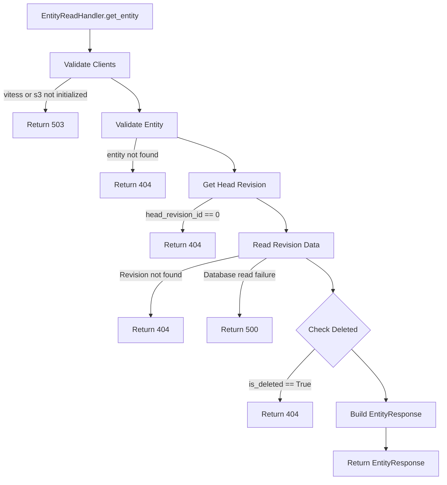

# Entity Get Process

## Error Handling
- Vitess not initialized → 503 Service Unavailable
- Entity not found in Vitess → 404 Not Found
- Head revision 0 → 404 Not Found
- Entity marked as deleted → 404 Not Found
- Revision not found → 404 Not Found
- Database read failure → 500 Internal Server Error
