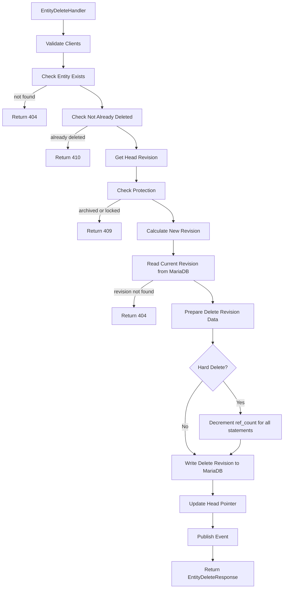

# Delete/Undelete Process

## Entity Delete Process

## Entity Undelete Process

Undelete is not implemented as a separate operation in the current codebase. Soft-deleted entities can be "undeleted" by performing an update operation that sets is_deleted=False in the revision data, effectively restoring the entity to an active state. This would follow the standard ENTITY UPDATE PROCESS.
