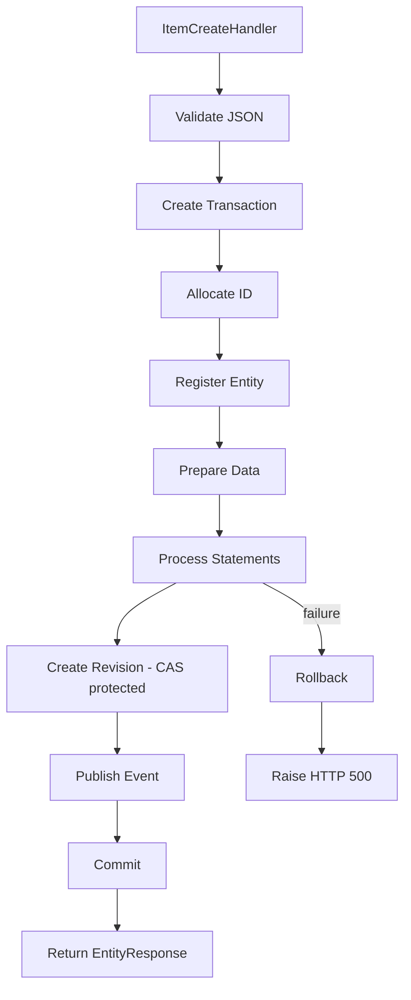
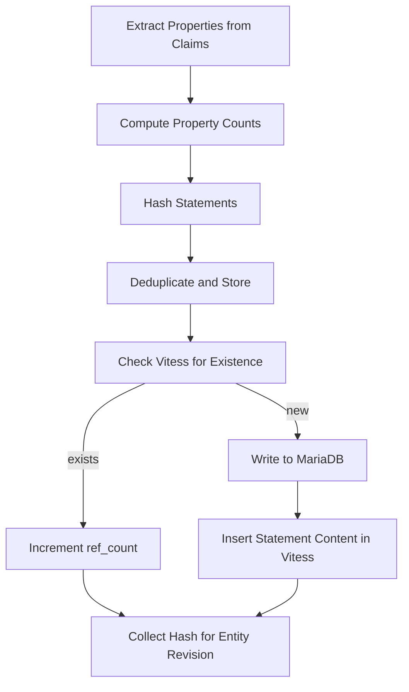

# Entity Create Process

```mermaid
flowchart TD
    A[ItemCreateHandler] --> B[Validate JSON]
    B --> C[Create Transaction]
    C --> D[Allocate ID]
    D --> E[Register Entity]
    E --> F[Prepare Data]
    F --> G[Process Statements]
    G --> H[Create Revision - CAS protected]
    H --> I[Publish Event]
    I --> J[Commit]
    J --> K[Return EntityResponse]
    G -->|failure| L[Rollback]
    L --> M[Raise HTTP 500]
```

## Statement Processing Detail

```mermaid
flowchart TD
    A[Extract Properties from Claims] --> B[Compute Property Counts]
    B --> C[Hash Statements]
    C --> D[Deduplicate and Store]
    D --> E[Check Vitess for Existence]
    E -->|exists| F[Increment ref_count]
    E -->|new| G[Write to MariaDB]
    G --> H[Insert Statement Content in Vitess]
    F --> I[Collect Hash for Entity Revision]
    H --> I
```
