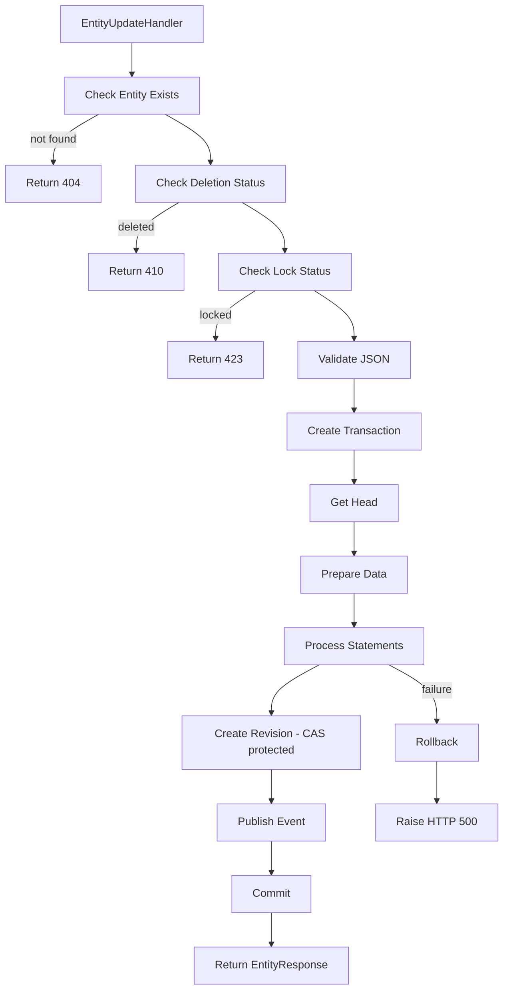
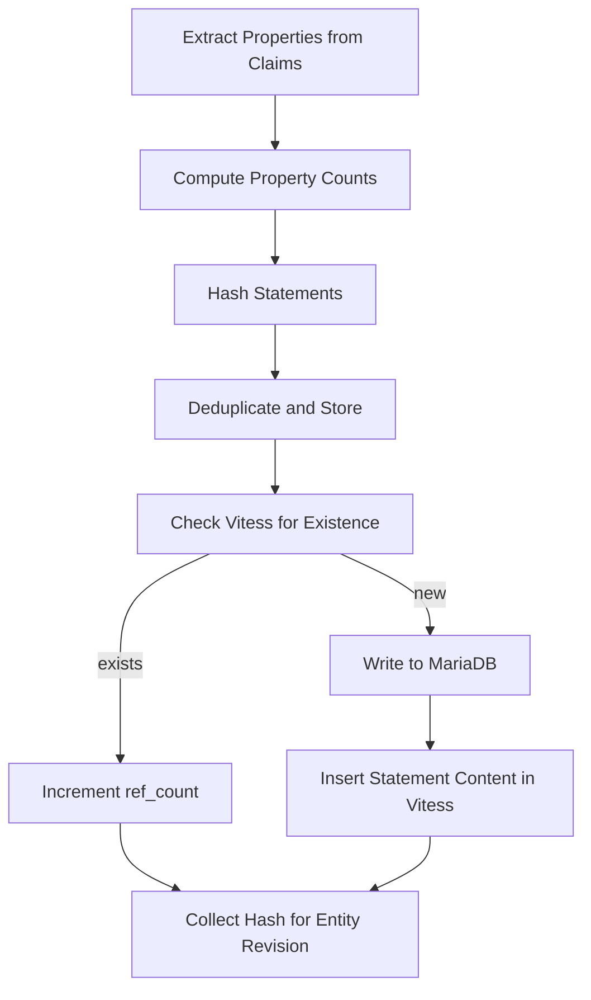

# Entity Update Process

```mermaid
flowchart TD
    A[EntityUpdateHandler] --> B[Check Entity Exists]
    B -->|not found| B1[Return 404]
    B --> C[Check Deletion Status]
    C -->|deleted| C1[Return 410]
    C --> D[Check Lock Status]
    D -->|locked| D1[Return 423]
    D --> E[Validate JSON]
    E --> F[Create Transaction]
    F --> G[Get Head]
    G --> H[Prepare Data]
    H --> I[Process Statements]
    I --> J[Create Revision - CAS protected]
    J --> K[Publish Event]
    K --> L[Commit]
    L --> M[Return EntityResponse]
    I -->|failure| N[Rollback]
    N --> O[Raise HTTP 500]
```

## Statement Processing Detail

```mermaid
flowchart TD
    A[Extract Properties from Claims] --> B[Compute Property Counts]
    B --> C[Hash Statements]
    C --> D[Deduplicate and Store]
    D --> E[Check Vitess for Existence]
    E -->|exists| F[Increment ref_count]
    E -->|new| G[Write to MariaDB]
    G --> H[Insert Statement Content in Vitess]
    F --> I[Collect Hash for Entity Revision]
    H --> I
```
