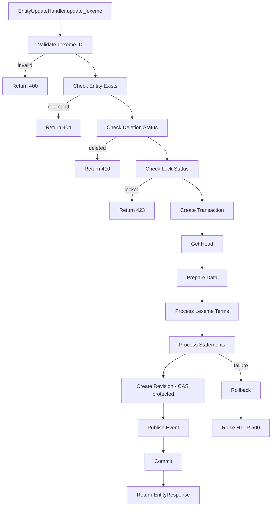
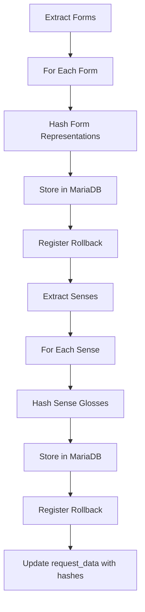
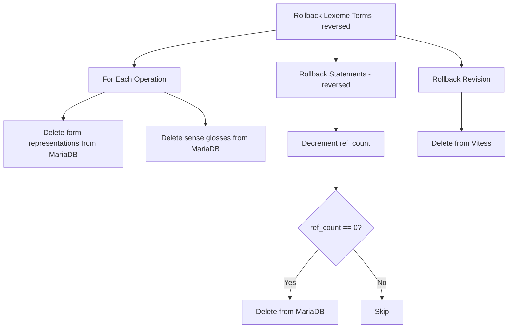

# Lexeme Update Process

```mermaid
flowchart TD
    A[EntityUpdateHandler.update_lexeme] --> B[Validate Lexeme ID]
    B -->|invalid| B1[Return 400]
    B --> C[Check Entity Exists]
    C -->|not found| C1[Return 404]
    C --> D[Check Deletion Status]
    D -->|deleted| D1[Return 410]
    D --> E[Check Lock Status]
    E -->|locked| E1[Return 423]
    E --> F[Create Transaction]
    F --> G[Get Head]
    G --> H[Prepare Data]
    H --> I[Process Lexeme Terms]
    I --> J[Process Statements]
    J --> K[Create Revision - CAS protected]
    K --> L[Publish Event]
    L --> M[Commit]
    M --> N[Return EntityResponse]
    J -->|failure| O[Rollback]
    O --> P[Raise HTTP 500]
```

## Lexeme Term Processing Detail

```mermaid
flowchart TD
    A[Extract Forms] --> B[For Each Form]
    B --> C[Hash Form Representations]
    C --> D[Store in MariaDB]
    D --> E[Register Rollback]
    E --> F[Extract Senses]
    F --> G[For Each Sense]
    G --> H[Hash Sense Glosses]
    H --> I[Store in MariaDB]
    I --> J[Register Rollback]
    J --> K[Update request_data with hashes]
```

## Rollback Detail

```mermaid
flowchart TD
    A[Rollback Lexeme Terms - reversed] --> B[For Each Operation]
    B --> C[Delete form representations from MariaDB]
    B --> D[Delete sense glosses from MariaDB]
    A --> E[Rollback Statements - reversed]
    E --> F[Decrement ref_count]
    F --> G{ref_count == 0?}
    G -->|Yes| H[Delete from MariaDB]
    G -->|No| I[Skip]
    A --> J[Rollback Revision]
    J --> K[Delete from Vitess]
```
