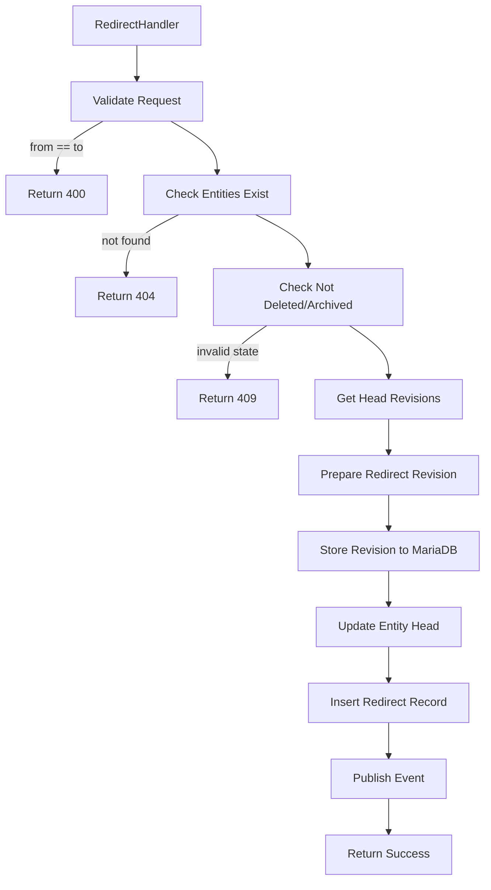
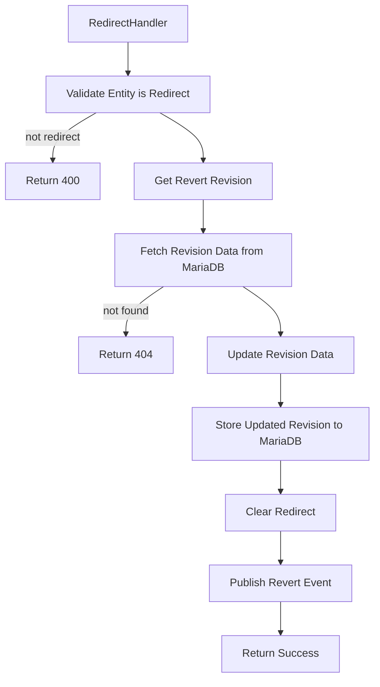

# Redirect Process

## Redirect Create Process

```mermaid
flowchart TD
    A[RedirectHandler] --> B[Validate Request]
    B -->|from == to| B1[Return 400]
    B --> C[Check Entities Exist]
    C -->|not found| C1[Return 404]
    C --> D[Check Not Deleted/Archived]
    D -->|invalid state| D1[Return 409]
    D --> E[Get Head Revisions]
    E --> F[Prepare Redirect Revision]
    F --> G[Store Revision to MariaDB]
    G --> H[Update Entity Head]
    H --> I[Insert Redirect Record]
    I --> J[Publish Event]
    J --> K[Return Success]
```

## Redirect Revert Process

```mermaid
flowchart TD
    A[RedirectHandler] --> B[Validate Entity is Redirect]
    B -->|not redirect| B1[Return 400]
    B --> C[Get Revert Revision]
    C --> D[Fetch Revision Data from MariaDB]
    D -->|not found| D1[Return 404]
    D --> E[Update Revision Data]
    E --> F[Store Updated Revision to MariaDB]
    F --> G[Clear Redirect]
    G --> H[Publish Revert Event]
    H --> I[Return Success]
```
