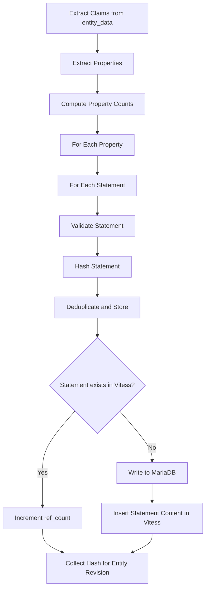
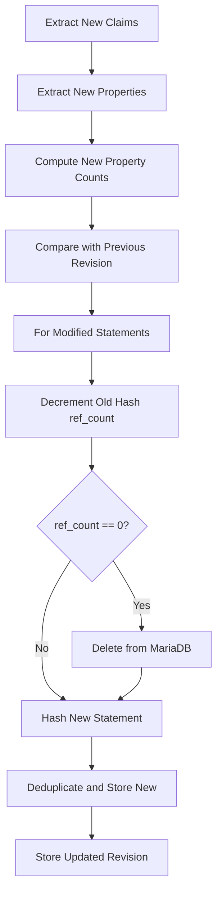
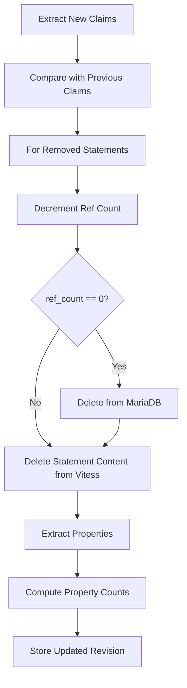
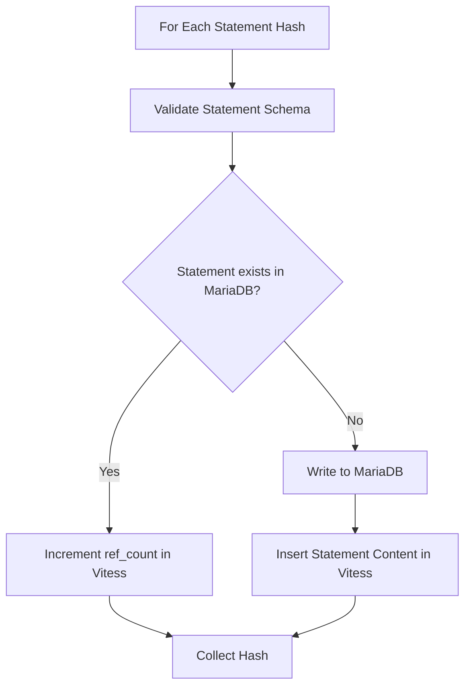

# Statement Processing Paths

## Statement Addition Path (During Entity Create/Update)

## Statement Modification Path (During Entity Update)

## Statement Removal Path (During Entity Update)

## Shared Deduplication Logic

Note: All statement operations occur within entity updates. Individual statement CRUD is not supported; statements are managed as part of entity revisions with reference counting for deduplication.
