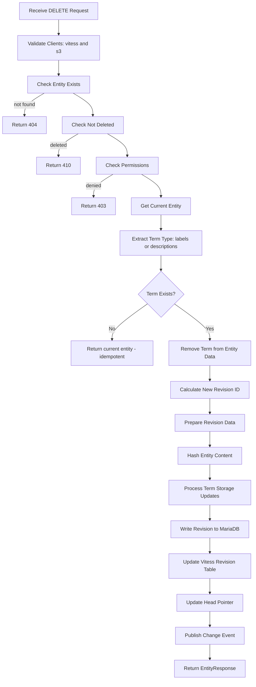
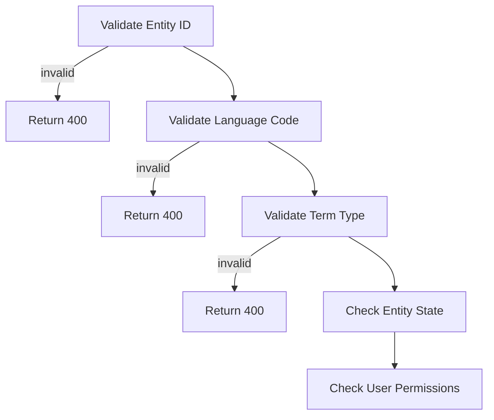
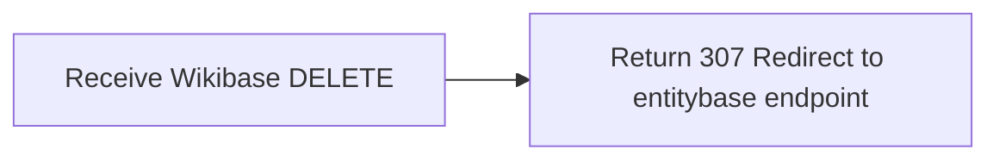

# Terms DELETE Process

## Term DELETE Path (Removing Labels/Descriptions for Language)



## Term DELETE Validation



## Wikibase API Redirect



## Error Handling

```
+--> Entity Not Found: 404 Not Found
+--> Entity Deleted: 410 Gone
+--> Entity Locked/Archived: 409 Conflict
+--> Invalid Language Code: 400 Bad Request
+--> Permission Denied: 403 Forbidden
+--> Storage Failure: 500 Internal Server Error
```

## Key Differences from Term PATCH

- **Complete Removal**: Deletes entire language entry vs partial array modification
- **No JSON Patch**: Simple key deletion vs complex operation application
- **Storage Cleanup**: Removes term entries entirely vs updating arrays
- **Idempotent**: Safe to delete non-existent terms
- **Term Type Scope**: Applies to labels/descriptions, not aliases

## Performance Characteristics

- **Read Operations**: 1 entity read, 1 revision fetch from MariaDB
- **Write Operations**: 1 revision write to MariaDB, 1 Vitess term delete (for labels)
- **Hash Calculations**: Full entity re-hash (simpler than PATCH selective updates)
- **Storage Impact**: Complete term removal vs array element modification

## Relationship to Term PATCH

- **Labels/Descriptions**: DELETE removes entire language entry
- **Aliases**: PATCH modifies array contents (no DELETE for aliases)
- **Use Cases**:
| Operation | Labels/Descriptions | Aliases |
|-----------|-------------------|---------|
| Remove Language | DELETE /labels/{lang} | PATCH with remove operations |
| Clear All | DELETE /labels/{lang} | PATCH remove all elements |
| Selective Edit | N/A | PATCH add/remove/replace |

Note: Term DELETE provides complete language-level removal for labels and descriptions, while PATCH handles granular alias modifications. Both follow entity update patterns with selective storage cleanup and full revision history preservation.
