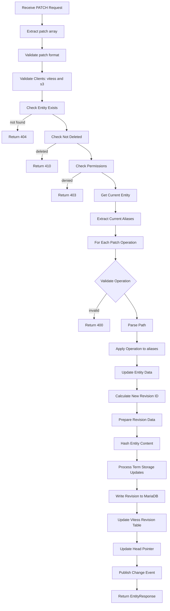
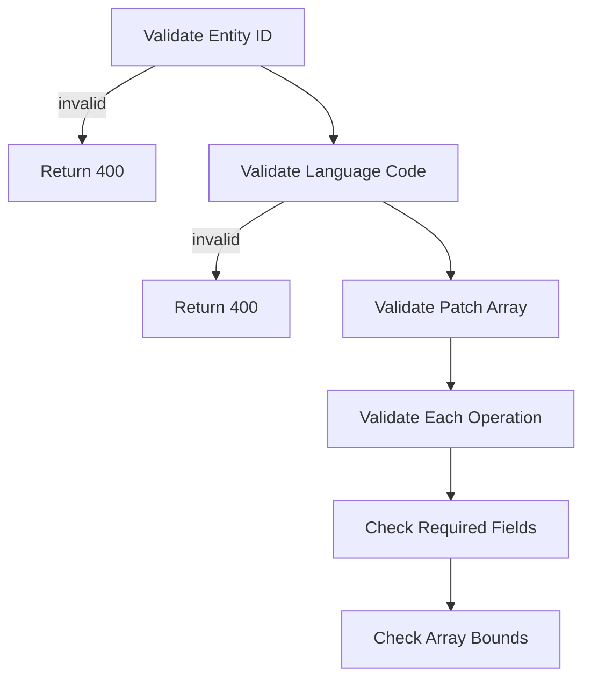
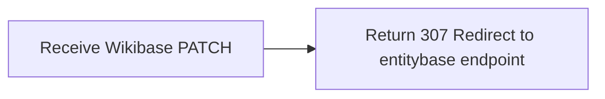

# Terms PATCH Process

## Term PATCH Path (JSON Patch Operations on Aliases)



## Term PATCH Validation



## Wikibase API Redirect



## Error Handling

```
+--> Invalid Patch Format: 400 Bad Request - "Invalid JSON Patch operation"
+--> Entity Not Found: 404 Not Found
+--> Permission Denied: 403 Forbidden
+--> Array Index Out of Bounds: 400 Bad Request - "Invalid array index"
+--> Unsupported Operation: 400 Bad Request - "Unsupported patch operation"
+--> Storage Failure: 500 Internal Server Error
```

## Key Differences from Full Entity Update

- **Targeted Modification**: Only aliases for one language are modified
- **JSON Patch Semantics**: Partial updates vs full replacement
- **Validation Complexity**: Array index validation + operation validation
- **Storage Updates**: Selective term storage updates vs full re-hash
- **Event Type**: TERM_PATCH vs ENTITY_UPDATE

## Performance Characteristics

- **Read Operations**: 1 entity read, 1 revision fetch from MariaDB
- **Write Operations**: 1 revision write to MariaDB, N Vitess term inserts/deletes
- **Hash Calculations**: Only for modified aliases, not entire entity
- **Revision Creation**: Same as entity update but with selective term processing

Note: Term PATCH operations follow entity update patterns but with JSON Patch semantics for precise alias modifications. This provides fine-grained control while maintaining revision history and deduplication benefits.
