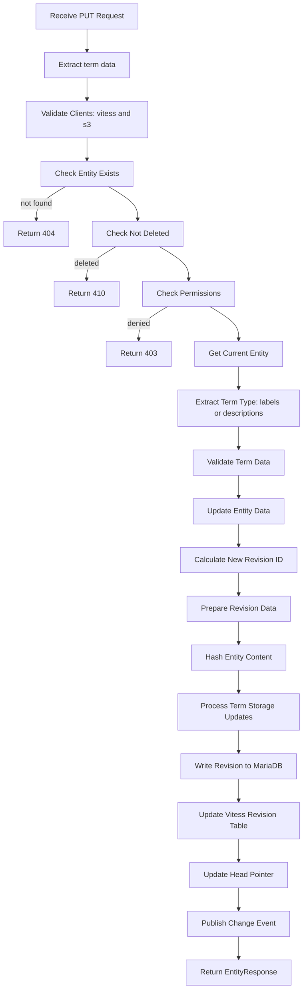
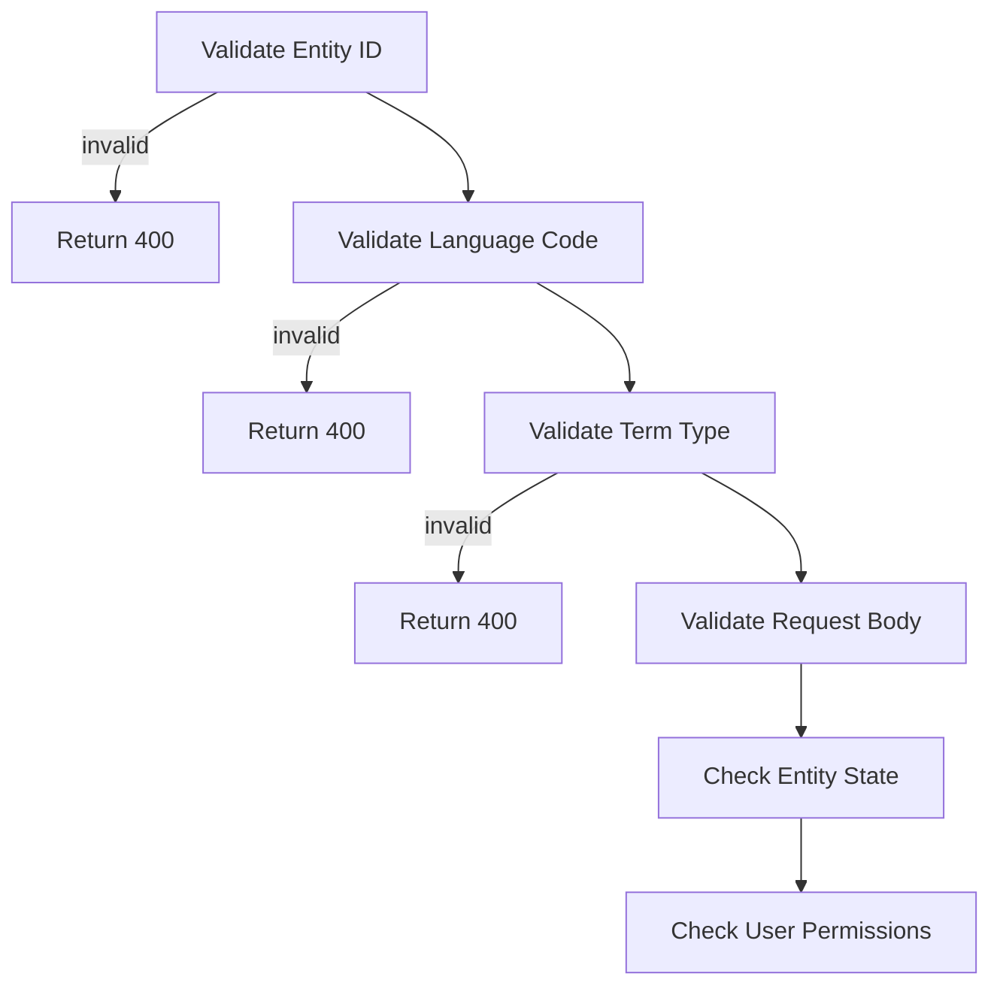
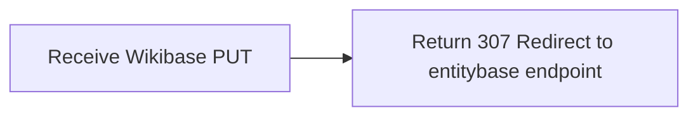

# Terms PUT Process

## Term PUT Path (Setting Labels/Descriptions for Language)



## Term PUT Validation



## Wikibase API Redirect



## Request Format Examples

### Labels PUT
```json
{
  "value": "English mathematician and writer",
  "tags": [],
  "bot": false,
  "comment": "set English label"
}
```

### Descriptions PUT (Wikibase format)
```json
{
  "description": "the subject is a concrete object (instance) of this class, category, or object group",
  "tags": [],
  "bot": false,
  "comment": "set English description"
}
```

## Error Handling

```
+--> Entity Not Found: 404 Not Found
+--> Entity Deleted: 410 Gone
+--> Entity Locked/Archived: 409 Conflict
+--> Invalid Request Format: 400 Bad Request
+--> Term Value Too Long: 400 Bad Request
+--> Permission Denied: 403 Forbidden
+--> Storage Failure: 500 Internal Server Error
```

## Key Differences from PATCH Operations

- **Complete Replacement**: PUT replaces entire term value vs PATCH partial modifications
- **Simple Validation**: Direct value validation vs JSON Patch operation validation
- **Storage Updates**: Full term replacement in storage vs selective updates
- **Use Cases**:
| Operation | Labels/Descriptions | Aliases |
|-----------|-------------------|---------|
| Set/Replace | PUT /labels/{lang} | PATCH add/replace operations |
| Partial Edit | N/A | PATCH operations |
| Language Add | PUT (creates if missing) | PATCH add operations |

## Performance Characteristics

- **Read Operations**: 1 entity read, 1 revision fetch from MariaDB
- **Write Operations**: 1 revision write to MariaDB, 1 Vitess term insert (for labels)
- **Hash Calculations**: Full entity re-hash + individual term hash
- **Storage Impact**: New term storage + updated revision metadata

## Relationship to Other Term Operations

- **GET**: Retrieve term value
- **PUT**: Set/replace entire term value
- **PATCH**: Apply partial modifications (aliases only)
- **DELETE**: Remove term entirely

Note: Term PUT provides complete value replacement for labels and descriptions, following entity update patterns with selective term storage management and full revision history preservation.
